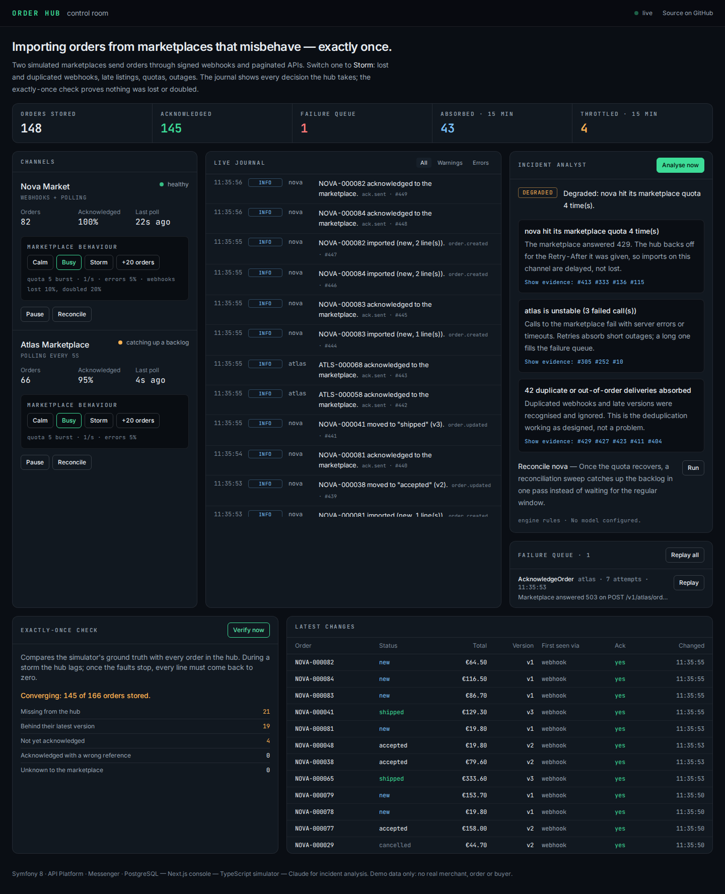
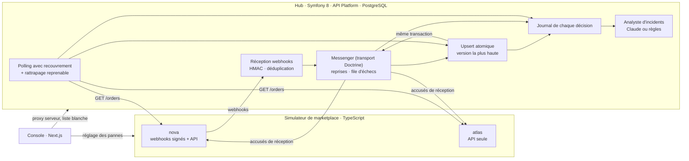

# Order Hub

[](https://github.com/michael-mas/Order-Hub/actions/workflows/ci.yml)

**Un hub d'intégration e-commerce qui importe les commandes de places de marché
capricieuses — exactement une fois, et en le prouvant.**



Un marchand vend sur plusieurs canaux. Les commandes arrivent par des webhooks
qui se perdent, arrivent en double ou dans le désordre, et par des API
paginées qui limitent le nombre d'appels, répondent `503` ou ne montrent une
commande que plusieurs secondes après sa création. Order Hub rend ce flux
fiable et observable, et le démontre face à un simulateur de marketplace que
chacun peut mettre en tempête depuis la console.

## Ce que le système garantit — et où c'est prouvé

| Garantie                                                                                   | Comment                                                                                                              | Preuve                                                                  |
| ------------------------------------------------------------------------------------------ | -------------------------------------------------------------------------------------------------------------------- | ----------------------------------------------------------------------- |
| Une commande reçue plusieurs fois n'est enregistrée et acquittée qu'une fois               | déduplication des webhooks par `event_id` ; clé naturelle `(canal, id)` ; accusé de réception idempotent             | `WebhookReceiverTest`, `OrderIngestorTest`                               |
| La dernière version gagne, quel que soit l'ordre d'arrivée                                 | un seul `INSERT … ON CONFLICT … WHERE version <` en PostgreSQL                                                        | `OrderIngestorTest::testTheHighestVersionWinsWhateverTheArrivalOrder`   |
| Rien n'est perdu : ni webhook égaré, ni commande visible en retard                         | polling à fenêtre courte avec recouvrement, rattrapage périodique reprenable                                         | `ChannelPollerTest`, test de résilience                                  |
| Un arriéré plus grand que le quota finit par se résorber                                   | point de reprise après chaque page, dans l'horloge de la marketplace                                                 | `ChannelPollerTest::testABacklogLargerThanTheQuotaDrainsAcrossPolls`    |
| Aucun effet de bord perdu ou doublé                                                        | l'accusé de réception part dans la même transaction que la commande (transport Doctrine = outbox)                    | `OrderIngestorTest`, ADR 0005                                            |
| Le quota de la marketplace est respecté                                                    | seau de jetons local par canal ; suspension sur `429` pour la durée de `Retry-After`                                 | `ChannelPollerTest`, `AcknowledgeOrderHandlerTest`                       |
| Un échec définitif est visible et rejouable                                                | reprises avec backoff, file d'échecs listable, rejeu atomique                                                        | `FailureQueueTest`                                                       |
| **Sous tempête, tout converge vers l'exact**                                               | vérité terrain du simulateur comparée à l'état du hub                                                                | [`e2e/tests/resilience.spec.ts`](e2e/tests/resilience.spec.ts), en CI    |

Le test de résilience met les deux canaux en préréglage `storm` pendant une
minute (webhooks perdus, doublés, désordonnés, listes en retard, quotas serrés,
`503`), coupe les pannes, puis exige que chaque commande de la marketplace
soit stockée une fois, à sa dernière version, et acquittée une fois avec la
référence du hub.

## Architecture



Composable sans dogme (MACH) : API d'abord (ressources et OpenAPI par API Platform),
console découplée qui ne consomme que l'API, services séparés par
responsabilité, conteneurs configurés par l'environnement.

## Composants

| Composant                               | Rôle                                                                                                | Pile                                                              |
| --------------------------------------- | --------------------------------------------------------------------------------------------------- | ----------------------------------------------------------------- |
| [`apps/hub`](apps/hub/)                 | Ingestion, file de messages, API d'exploitation, analyste d'incidents                               | PHP 8.4, Symfony 8.1, API Platform 4, Doctrine, Messenger ; PostgreSQL ou SQLite (démo) |
| [`apps/marketplace`](apps/marketplace/) | Deux marketplaces simulées, pannes réglables, déterministes à partir d'une graine                   | Node 22, TypeScript, Hono, zod                                    |
| [`apps/console`](apps/console/)         | Salle de contrôle : journal en direct, pannes, opérations, rejeu, analyse, contrôle « exactement une fois » | Next.js 16, React 19, Tailwind 4                              |
| [`e2e`](e2e/)                           | Bout en bout, accessibilité, résilience                                                             | Playwright, axe                                                   |

## Démarrer

### Avec Docker

```bash
docker compose up --build
```

Puis <http://localhost:3000>. Le hub écoute sur <http://localhost:8000> (la
description OpenAPI des ressources est sur `/api/docs.jsonopenapi`), le
simulateur sur <http://localhost:8100>.

### Sans Docker

Prérequis : PHP 8.4 (`pdo_pgsql`, `intl`), Composer, Node 22, PostgreSQL 16.

```bash
npm install
(cd apps/hub && composer install && bin/console doctrine:database:create && bin/console doctrine:migrations:migrate -n)
npm run build --workspace @order-hub/console
e2e/stack.sh start        # simulateur, hub, worker, console ; base dédiée app_e2e
```

`e2e/stack.sh stop` arrête tout.

### Héberger la démo publique

Une seule image, sans base de données à provisionner : le hub, son worker, le
simulateur et la console tournent ensemble sur un fichier SQLite éphémère,
recréé à chaque démarrage (et au plus tard toutes les 24 h,
`DEMO_RESET_AFTER_HOURS`). Seule la console est exposée ; elle parle au hub et
au simulateur en local, à travers sa liste blanche.

```bash
docker build -f docker/demo/Dockerfile -t order-hub-demo .
docker run -p 3000:3000 order-hub-demo        # le port suit $PORT
```

La CI construit cette image, la démarre et joue contre elle toute la suite de
bout en bout, tempête comprise, puis mesure la mémoire du conteneur
(`docker stats`, job « Demo image ») : 226 Mio au premier relevé, après les
deux suites. Pour que Claude rédige les analyses, définir `ANTHROPIC_API_KEY` ;
sans clé, le moteur de règles répond.

#### Sans abonnement : l'offre gratuite de Render

[](https://render.com/deploy?repo=https://github.com/michael-mas/Order-Hub)

Le Blueprint [`render.yaml`](render.yaml) demande une instance gratuite
(512 Mo, 0,1 CPU).

1. Render → **New** → **Blueprint** → ce dépôt (ou le bouton ci-dessus) →
   **Apply**. Render construit l'image et publie la démo sur une adresse
   `*.onrender.com`.
2. Facultatif : renseigner `ANTHROPIC_API_KEY` dans l'environnement du service.
3. Facultatif : un sous-domaine (`demo.<domaine>`) : l'ajouter comme domaine
   personnalisé du service Render, puis créer l'enregistrement `CNAME`
   indiqué par Render chez le gestionnaire DNS du domaine.

L'instance gratuite s'endort après 15 minutes sans visite ; la visite suivante
la réveille et trouve une démo neuve. Que l'image tienne dans ces limites est
vérifié, pas supposé : la CI la démarre avec `--memory=512m --cpus=0.1` et y
joue la suite de la console (job « Demo image on a small free instance »).
Premier relevé (run 30) : console, hub et simulateur sains 25 s après le
`docker run`, les 6 tests de la console verts, 187 Mio de mémoire utilisés sur
512. Au réveil sur Render s'ajoute le démarrage de l'instance elle-même, non
mesuré ici.

L'image est aussi publiée à chaque commit sur `main`, téléchargeable sans
compte, pour tout hébergeur qui lance une image existante :

```bash
docker run -p 3000:3000 ghcr.io/michael-mas/order-hub-demo:latest
```

**Et Vercel ?** Vercel héberge très bien la console Next.js, mais pas le reste :
le worker Messenger et le simulateur sont des processus qui tournent en
continu, et le hub a besoin d'un stockage qui survive entre deux requêtes ;
les fonctions serverless n'offrent ni l'un ni l'autre. Un site sur Vercel
(un portfolio, par exemple) renvoie simplement vers la démo hébergée ailleurs.

### Scénario de démonstration

1. Ouvrir la console : les commandes arrivent, le journal défile.
2. Passer **Nova Market** puis **Atlas Marketplace** en **Storm**. Le journal
   se remplit de doublons absorbés, de versions périmées ignorées, de quotas
   dépassés, de reprises.
3. **Analyse now** : l'analyste explique la situation ; « Show evidence »
   surligne les entrées du journal citées ; chaque action attend un clic.
4. Repasser en **Calm**, **Replay all** si la file d'échecs n'est pas vide,
   puis **Verify now** jusqu'à « Consistent ».

## L'analyste d'incidents

- Un seul appel à Claude (`claude-opus-5` par défaut), sortie structurée par
  JSON Schema : niveau, résumé, constats, recommandations.
- Chaque constat doit citer des identifiants du journal fourni ; les
  références inventées sont retirées avant affichage, et comptées.
- Les recommandations viennent d'une liste fermée ; l'analyste n'exécute
  rien, un humain clique.
- Sans `ANTHROPIC_API_KEY`, un moteur de règles répond dans le même format.
  Les tests et la démo publique fonctionnent sans clé ; la console limite la
  fréquence des analyses.

Décision complète : [ADR 0004](docs/adr/0004-analyste-ia-encadre.md).

## Qualité

| Niveau                    | Outils                                            | Où                                              |
| ------------------------- | ------------------------------------------------- | ----------------------------------------------- |
| Unitaire                  | PHPUnit, Vitest                                   | hub, simulateur, console                        |
| Propriétés                | fast-check                                        | simulateur (quota, pagination, signature)       |
| Intégration               | PHPUnit sur PostgreSQL **et** SQLite réels, transaction annulée | hub (upsert, file d'échecs, polling) |
| HTTP                      | noyau Symfony, `app.request` de Hono              | hub, simulateur                                 |
| Composants                | Testing Library                                   | console                                         |
| Bout en bout              | Playwright, bureau et mobile                      | système complet                                 |
| Accessibilité             | axe (WCAG 2.1 AA, aucune violation sérieuse)      | console                                         |
| Résilience                | scénario `storm` + vérité terrain                 | système complet                                 |
| Architecture              | Deptrac (le domaine ignore le framework)          | hub                                             |
| Analyse statique et style | PHPStan niveau max, PHP-CS-Fixer, TypeScript strict, ESLint | partout                               |

Tout tourne en CI à chaque commit : la suite du hub sur les deux bases, la
construction et le démarrage des images Docker, et la suite de bout en bout
deux fois, contre la pile PostgreSQL et contre l'image de démo SQLite.

## Documentation

- [`docs/ARCHITECTURE.md`](docs/ARCHITECTURE.md) — flux, garanties, contrats
- [`docs/adr/`](docs/adr/) — décisions d'architecture
- [`docs/PLAN.md`](docs/PLAN.md) — objectifs et jalons
- [`docs/JOURNAL.md`](docs/JOURNAL.md) — journal daté, défauts trouvés compris
- [`apps/marketplace/README.md`](apps/marketplace/README.md) — API du simulateur
- [`apps/hub/README.md`](apps/hub/README.md) — API du hub, exploitation
- [`docker/demo/`](docker/demo/) — image et script de la démo autonome

Données de démonstration uniquement : aucun marchand, aucune commande, aucun
acheteur réel.

## Licence

MIT — voir [`LICENSE`](LICENSE).
