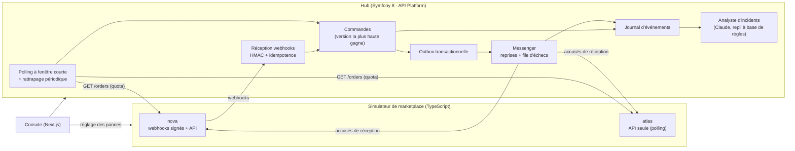

# Order Hub

**Un hub d'intégration e-commerce composable : importer les commandes de places
de marché capricieuses de façon fiable, observable et exactement une fois.**

Un marchand vend sur plusieurs canaux. Les commandes arrivent par des API
hétérogènes, avec des quotas, des webhooks qui se perdent, arrivent en double ou
dans le désordre, des listes qui ne montrent une commande que plusieurs secondes
après sa création, des pannes. Order Hub montre comment on rend ce flux fiable —
et le démontre face à un simulateur de marketplace qu'on peut volontairement
mettre en difficulté.

> Statut : **en construction.** Le simulateur de marketplace est terminé et
> testé. Le hub, la console et l'analyste d'incidents IA arrivent ensuite (voir
> [Feuille de route](#feuille-de-route)). Ce README ne décrit comme disponible
> que ce qui l'est.

## Architecture



MACH, sans dogme : **API-first** (contrats publiés, clients générés),
**headless** (la console ne consomme que l'API), **services** découpés par
responsabilité — pas davantage que nécessaire —, **cloud-native** (conteneurs,
configuration par l'environnement, santé, journaux structurés).

## Composants

| Composant                               | Rôle                                                                                                  | État            |
| --------------------------------------- | ----------------------------------------------------------------------------------------------------- | --------------- |
| [`apps/marketplace`](apps/marketplace/) | Simulateur de deux marketplaces : quotas, pannes, webhooks signés perdus / dupliqués / désordonnés     | ✅ terminé, testé |
| [`apps/hub`](apps/hub/)                 | Ingestion fiable : webhooks, polling, idempotence, outbox, reprises, journal, analyste IA             | 🚧 squelette     |
| `apps/console`                          | Salle de contrôle : journal en direct, réglage des pannes, rejeu des échecs, diagnostic IA            | ⏳ à venir       |
| `e2e`                                   | Bout en bout Playwright + test de résilience « exactement une fois sous pannes »                       | ⏳ à venir       |

## Ce que le simulateur sait faire subir au hub

Deux canaux aux styles opposés, pour couvrir les deux stratégies d'intégration :

- **`nova`** pousse des webhooks signés (HMAC-SHA256 sur `horodatage.corps`,
  tolérance de 5 minutes) et expose une API ;
- **`atlas`** n'expose qu'une API : le hub doit l'interroger.

Pannes réglables à chaud, par canal :

| Panne                  | Effet                                                                     |
| ---------------------- | ------------------------------------------------------------------------- |
| Quota du forfait       | seau de jetons ; `429` avec un `Retry-After` exact                        |
| Erreurs serveur        | une part des appels répond `503`                                          |
| Latence                | délai aléatoire borné                                                     |
| Cohérence à terme      | une commande n'apparaît dans les listes qu'après un délai                 |
| Webhooks perdus        | jamais envoyés : seul le polling de rattrapage les retrouve               |
| Webhooks en double     | même `event_id` livré deux fois                                           |
| Webhooks désordonnés   | délais aléatoires : une mise à jour peut arriver avant la création        |
| Rejets côté hub        | le simulateur réessaie avec un backoff exponentiel, puis abandonne        |

Trois préréglages : `calm`, `busy` (pic de ventes), `storm` (tout à la fois).
Tout est **déterministe à partir d'une graine** : régler les pannes ne change
jamais le contenu des commandes, et un scénario se rejoue à l'identique.

## Démarrer

Prérequis : Node 22.

```bash
npm install
npm run dev --workspace @order-hub/marketplace   # http://localhost:8100
```

```bash
# État des deux canaux
curl -s localhost:8100/control/marketplaces

# Passer nova en tempête
curl -s -X PUT localhost:8100/control/marketplaces/nova/preset/storm

# Lire les commandes comme le ferait le hub
curl -s -H 'authorization: Bearer nova-demo-key' \
  'localhost:8100/v1/nova/orders?updated_since=2026-01-01T00:00:00Z&limit=10'
```

Référence complète de l'API du simulateur : [`apps/marketplace/README.md`](apps/marketplace/README.md).

## Qualité

| Contrôle                           | Commande                                         |
| ---------------------------------- | ------------------------------------------------ |
| Tout le JavaScript/TypeScript      | `npm run verify`                                 |
| Format                             | `npm run format:check`                           |
| Simulateur : typecheck, lint, tests | `npm run verify --workspace @order-hub/marketplace` |

Le simulateur est couvert par des tests unitaires, des **tests de propriétés**
(fast-check : le seau de jetons ne sert jamais plus que son budget, la
pagination liste chaque commande exactement une fois quelle que soit la taille
de page, une signature ne vérifie que ce qu'elle a signé…) et des tests HTTP de
bout en bout sur l'application. TypeScript strict, ESLint en mode
`strictTypeChecked`, zéro avertissement toléré, `Math.random` interdit.

Le hub suivra la même exigence : PHPUnit (unitaire, intégration, API), PHPStan
au niveau maximal, PHP-CS-Fixer, Deptrac pour les frontières d'architecture.

## Feuille de route

1. **Hub** — domaine des commandes, réception des webhooks (signature,
   idempotence), polling à fenêtre courte avec recouvrement et rattrapage,
   respect du quota, outbox transactionnelle, Messenger avec reprises et file
   d'échecs rejouable, journal d'événements.
2. **Analyste d'incidents IA** — Claude reçoit les événements récents et l'état
   des canaux, rend un diagnostic structuré dont chaque preuve renvoie à un
   événement réel (les références inventées sont écartées), et propose des
   actions qu'un humain valide. Sans clé d'API, un moteur de règles prend le
   relais avec le même format.
3. **Console** — journal en direct, réglage des pannes, rejeu, diagnostic.
4. **Preuve** — `compose.yaml`, CI GitHub Actions, Playwright avec contrôle
   d'accessibilité, et un test de résilience : sous préréglage `storm`, chaque
   commande du simulateur finit importée une fois, à sa dernière version, et
   acquittée une fois.

Détails et choix : [`docs/`](docs/).

## Documentation

- [`docs/PLAN.md`](docs/PLAN.md) — objectifs, périmètre, jalons
- [`docs/ARCHITECTURE.md`](docs/ARCHITECTURE.md) — contrats, garanties, flux
- [`docs/adr/`](docs/adr/) — décisions d'architecture
- [`docs/JOURNAL.md`](docs/JOURNAL.md) — journal daté des décisions

## Licence

MIT — voir [`LICENSE`](LICENSE).
